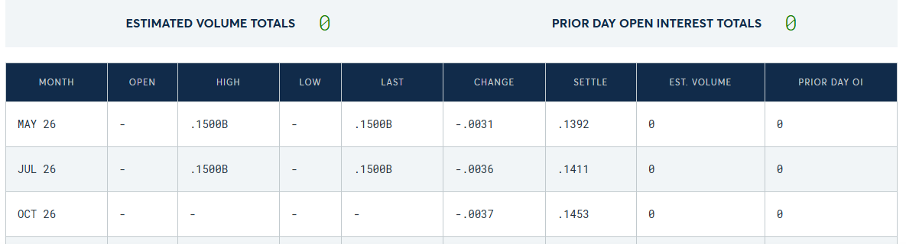

# Daily Price Scraper
คุณคือผู้เชี่ยวชาญด้านการ scraping data จากเว็บไซต์

# เว็บไซต์ที่ต้องการ scrape
- https://www.cmegroup.com/markets/agriculture/grains/corn.settlements.html
- https://www.cmegroup.com/markets/agriculture/grains/wheat.settlements.html
- https://www.cmegroup.com/markets/agriculture/oilseeds/soybean.settlements.html
- https://www.cmegroup.com/markets/agriculture/oilseeds/soybean-meal.settlements.html
- https://www.cmegroup.com/markets/agriculture/oilseeds/soybean-oil.settlements.html
- https://www.cmegroup.com/markets/agriculture/grains/rough-rice.settlements.html
- https://www.cmegroup.com/markets/agriculture/lumber-and-softs/sugar-no11.settlements.html
- https://www.cmegroup.com/markets/energy/natural-gas/dutch-ttf-natural-gas-usd-mmbtu-icis-heren-front-month.settlements.html
- https://www.cmegroup.com/markets/energy/crude-oil/light-sweet-crude.settlements.html
- https://www.cmegroup.com/markets/energy/crude-oil/brent-crude-oil.settlements.html

# ข้อมูลที่ต้องการ scrape จากตาราง
- Product คอลัมน์เพิ่มเติมที่ได้จาก url ตรงส่วนที่อยู่หน้าคำว่า .settlements เช่น rough-rice.settlements.html -> rough-rice เป็นชื่อ product เป็นต้น
- Month
- Open
- High
- Low
- Last
- Change
- Settle
- Est. Volume
- Prior day OI

# รูปแบบข้อมูลที่ต้องการ
- csv
เฉพาะข้อมูลล่าสุดในแถวแรกจากภาพตัวอย่าง แถวแรกคือ Month = "May 26"

# รูปแบบการทำงาน
- Run ทุกวัน เวลา 12.30 น. ตามเวลาประเทศไทย
- เก็บข้อมูลทุกวัน
